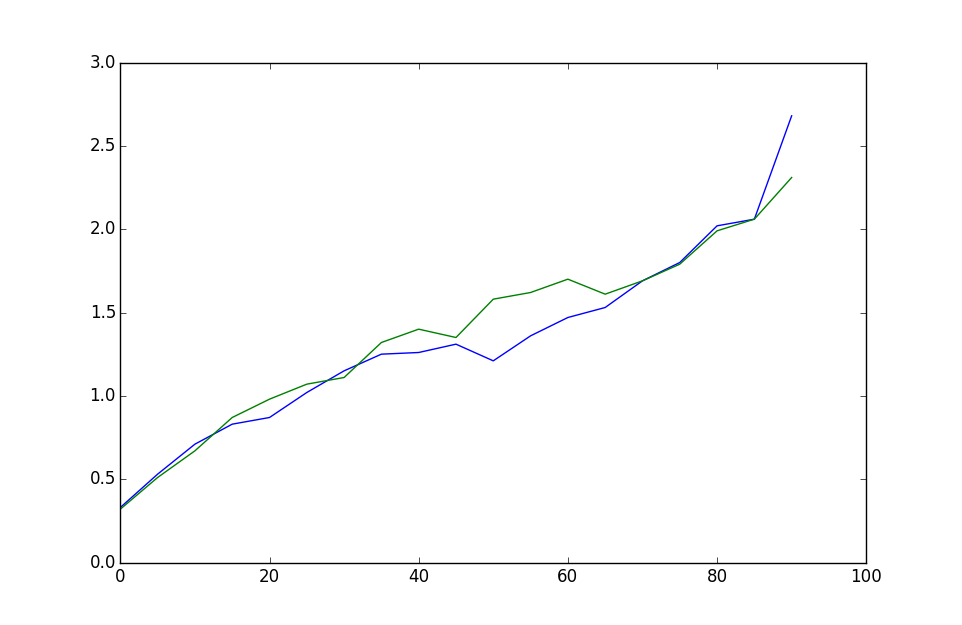

# Preemptive-Controller-Message
Experiments on the preemptive behavior of SDN controller message in openvswitch.

## Build Instructions
1. Platform:
  * Arch Linux

2. Prerequisite:
  * build tools (gcc, make, git, ...)
  * Python 2.7.x
  * Open vSwitch >= 2.3.1 ([Download](http://openvswitch.org/download/), compile and install without kernel modules)
  * Mininet >= 2.2.0
  * Ryu >= 3.19

3. Compile modified linux kernel (unless specified otherwise, all commands are executed in root directory of the project)
  1. Clone kernel submodule
    ```shell
    git submodule init
    git submodule update --depth=1
    ```

  2. Compile kernel
    ```shell
    cd linux
    make mrproper
    zcat /proc/config.gz > .config      # use system default kernel config
    make olddefconfig
    make -j4                            # compile using 4 threads
    ```

  3. Install kernel
    ```shell
    cd linux
    sudo make modules_install
    sudo cp arch/x86_64/boot/bzImage /boot/vmlinuz-linux
    sudo mkinitcpio -p linux            # regenerate initramfs
    ```

  4. Compile Open vSwitch modules
    ```shell
    bash genmodules.sh
    ```

  5. Reboot

## Usage
An automated test shell script is provided by ``runtest.sh``:
```shell
sudo bash runtest.sh
```

The script performs tests across different flow miss rates with or without preemptive behaviors, generating:
* ``preemptive_full.dat``: contains full test results of preemptive behaviors;
* ``nonpreemptive_full.dat``: contains full test results of non-preemptive behaviors;
* ``preemptive.dat``: contains an array of average costs of preemptive behaviors;
* ``nonpreemptive.dat``: contains an array of average costs of non-preemptive behaviors.

Additionally, the shell script will display a graph based on data gathered when tests are completed.

## Result
Blue for preemptiveness, and green for non-preemptiveness.



## Userspace Implementation
Userspace Openflow virtual switch implementation with preemptive behavior can be found in directory ``openflow/``. This implementation is based on Openflow 1.0 standard reference switch from Stanford University, but unfortunately it comes with poor performance, link speed of which is measured 1Mbit/s, comparing to ~20Gbit/s on Open vSwitch. For those who interested, build instructions are followed (clang required).
```shell
cd openflow
./configure --prefix=/usr --localstatedir=/var CC=clang
make
sudo make install
```
The code adds an argument ``--prioritize`` to original datapath simulator ``ofdatapath``. To use it with Mininet, specify using ``UserSwitch`` when creating topology and pass the parameter ``--prioritize`` when constructing switches:
```python
from mininet.node import UserSwitch
net = Mininet(switch = UserSwitch)
net.addSwitch('s1', dpopts = '--prioritize')
```

## Contact
Any questions, please email to mystery.wd#gmail.com.
This project is licensed under GPLv2, see [LICENSE](./LICENSE).
